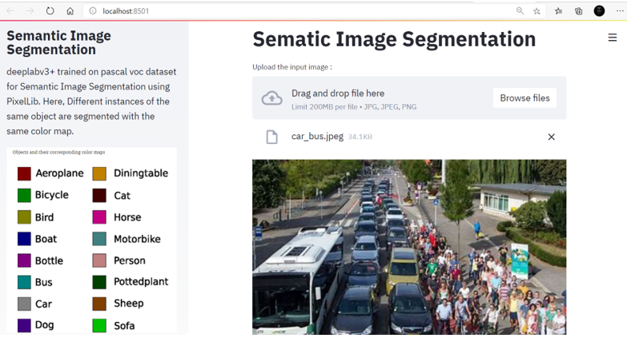
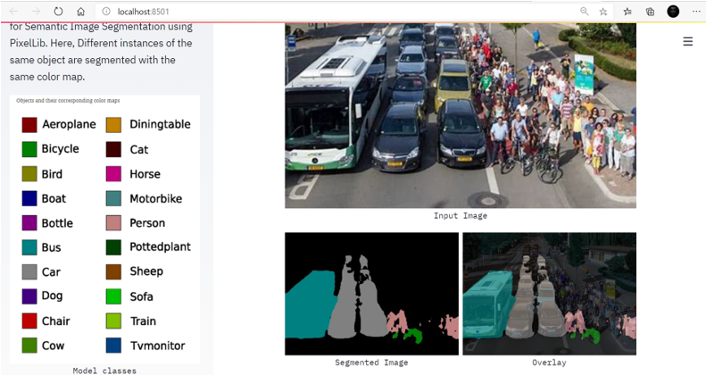

# Semantic Image Segmentation 
deeplabv3+ trained on pascal voc dataset for Semantic Image Segmentation using PixelLib

Here, Different instances of the same object are segmented with the same color map.

## Steps to run the Web Application

1) Clone this repository 
2) Download the weights file if not present [view](https://github.com/ayoolaolafenwa/PixelLib/releases/download/1.1/deeplabv3_xception_tf_dim_ordering_tf_kernels.h5) make sure it is kept in the current root directory.
3) Open a terminal and type 
  `pip install -r requirements.txt` to install the dependencies.
4) To deploy the webapp simple type 
  `streamlit run app.py` and wait for the webapp to open in the browser.
5) If the webapp doesn't open by default, keeping the terminal open, in the browser search
  `localhost:8501/`
 
You can now see the website up and running.

## Demo Snapshots

## Classes Segmented by the model

