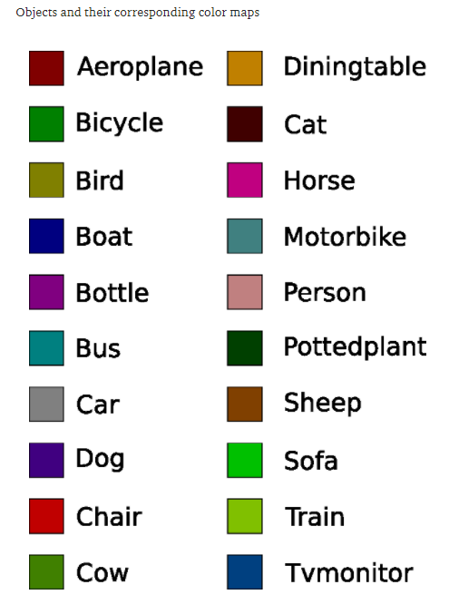

# Semantic Image Segmentation
deeplabv3+ trained on pascal voc dataset for Semantic Image Segmentation using PixelLib

Here, Different instances of the same object are segmented with the same color map.

## Classes Segmented by the model

